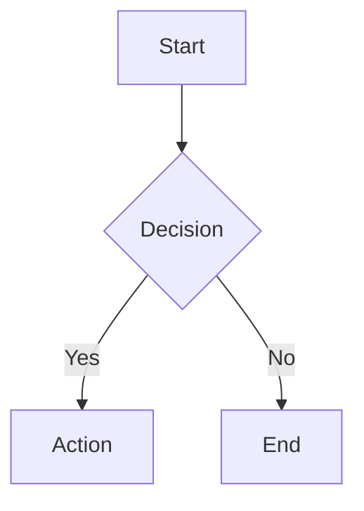

# Xyra

A minimal Hugo theme with light/dark mode support.

## Requirements

- Hugo 0.146.0+ (standard, not extended)
- Go 1.26.1+

## Installation

### As a Hugo Module

1. Initialize your site as a Hugo module:
   ```bash
   hugo mod init github.com/username/your-site
   ```

2. Add to your site's `hugo.toml`:
   ```toml
   [module]
     [[module.imports]]
       path = "github.com/xudong-yang/xyra"
   ```

3. Get the theme:
   ```bash
   hugo mod get
   ```

### As a Git Submodule

```bash
git submodule add https://github.com/xudong-yang/xyra.git themes/xyra
```

Then add to your `hugo.toml`:
```toml
theme = ['xyra']
```

## Configuration

### Basic `hugo.toml`

```toml
title = 'Your Site'
baseURL = 'https://example.org/'
languageCode = 'en-US'

[params]
  description = "Your site description"

[menu]
  [[menu.main]]
    name = 'posts'
    pageRef = '/posts'
    weight = 20
```

### Code Highlighting

The theme enables line numbers for code blocks by default. This can be configured:

```toml
[markup]
  [markup.highlight]
    lineNos = true
    lineNumbersInTable = true
```

## Shortcodes

### Badge

Display certification or achievement badges:

```

```

### Badges

Container for multiple badges:

```




```

### YouTube

Embed YouTube videos (privacy-enhanced mode):

```

```

### Carousel

Horizontal scrolling image carousel:

```




```

## Mermaid Diagrams

Create diagrams using fenced code blocks with the `mermaid` language:

````markdown

````

## Content Structure

### Front Matter

```toml
+++
title = 'Post Title'
date = 2023-01-05T09:00:00-07:00
draft = false
tags = ['tag1', 'tag2']
+++

Your content here.
```

### Relative Links

Use Hugo's `relref` for internal links:

```markdown
[Link to Post]({})
```

## Development

Run the development server:

```bash
hugo server
```

Build for production:

```bash
hugo
```

## License

MIT License - see [LICENSE](LICENSE)
